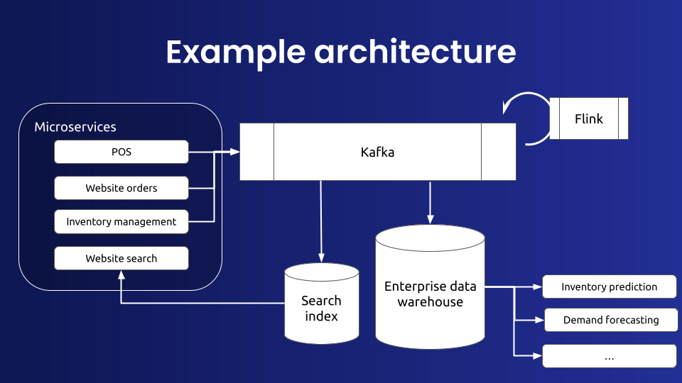
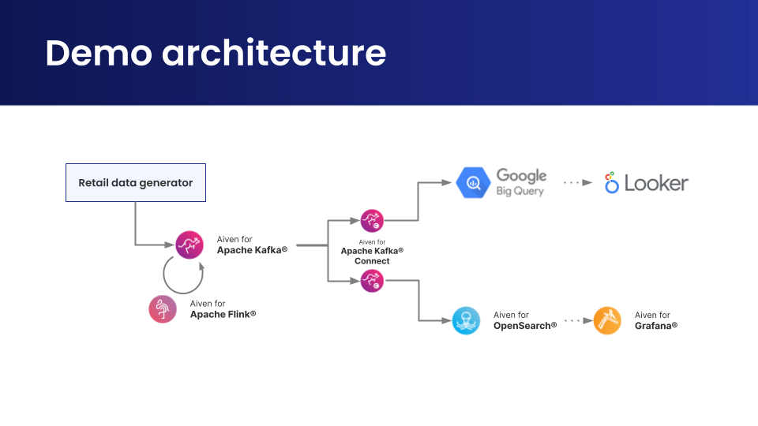
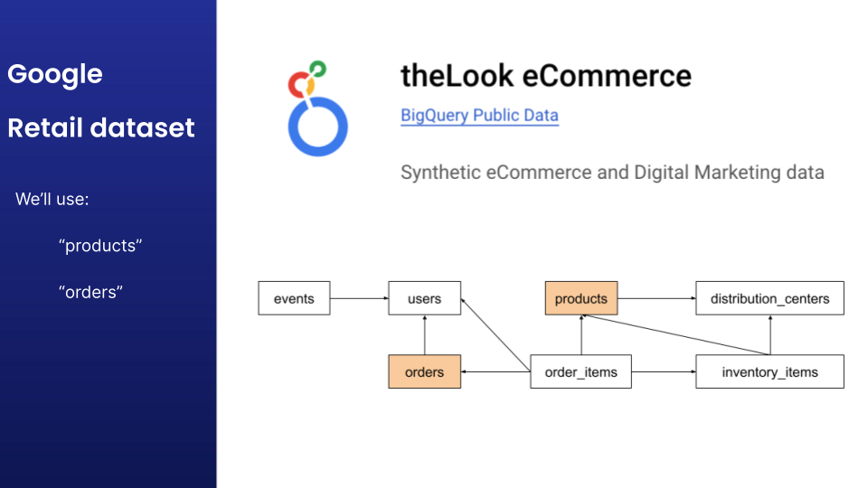

# An Aiven data pipeline with Kafka, Flink, OpenSearch and BigQuery
This material can be used as a demo and/or hands-on workshop to demonstrate in a very short time many Aiven capabilities in a smooth compelling storytelling

The full demo can take up to ~30mn but many features can be omitted to reduce this time to ~10mn if needed

The general architecture that this demo is demonstrating:


The concrete services that are going to be used:


The Google BigQuery public eCommerce retail fake data:


🎥 [The full 30mn recorded video (with chapters) that demonstrate all of this](https://video.aiven.io/watch/EDTGU4NXhYRcaHqTdGpkgS?)

📊 [The slides that support this hands-on](https://docs.google.com/presentation/d/1plMjAsLd5FfGJOJm6LiBPvBCDv3l1IPSGAolPG4f7C8/edit?usp=sharing)

# Files
- requirements.txt
- main.py
- order_microservice.py
- product_microservice.py
- order_schema.py
- product_schema.py
- products.json
- csv_to_json.py

# Development/Progression
- Start from the aiven.io main webpage and point out the Get started button
- Create a Kafka **💡 rename the service simply "kafka", "os", "flink"**
  - Go through the Overview tab (explain each config)
    - Activate Rest, Schema & Connector
- Create an OpenSearch **💡 pick version 1 to be able to bump it later on**
- Setup avn CLI
- Create Kafka topics, send data `python main.py` and fetch messages from the console
- Create Kafka BigQuery connector **⏳ it's gonna take some time so move on to the next connector**
- Create Kafka OpenSearch connector and Query the data in OS right away
- Query data in BQ **data should be there by now** and export to Looker (just 1 click)
- Integrate Kafka metrics to InfluxDB+Grafana **⏳ it's gonna take some time so move on to the next integration**
- Integrate Kafka logs to the running OS service and demo Query the logs right away
- Bump OS version (while logs are flowing to demonstrate the zero downtime)
- Query the metrics in Grafana **data should be there by now**
  - If Grafana is still not up by that time, **💡 Show the Kafka Service “Quick connect” button**
- Introduce Flink (with the Carbon Footprint new field) to finish that off 🫳🎤

# Prerequisites
- Have the 🎥 video ready in case there is a problem (internet, aiven console, ...)
- Set your computer & smartphone on “do not disturb” (and turn the sound off)
- Google BigQuery is already authenticated with the dataset emptied
- Aiven console already authenticated and the project is emptied of all services
- All Windows are Minimized except:
  - A Chrome tab with the slides
  - A Chrome tab on aiven.io
  - A Chrome tab on the Aiven BigQuery Google Console
  - A Terminal (with a big font) already at the right $path
    - Another terminal tab with the BigQuery JSON keyfile ready to be `|pbcopy`

# Cheatsheet (have this displayed on another screen or printed out on paper while you demo)
```
pip install aiven-client
avn project details && avn project switch data-pipeline
avn service list
avn user login --token
avn service user-creds-download --project data-pipeline --username avnadmin kafka
pip install -r requirements.txt
```

# Todo
- [ ] Add the flink demo to the hands-on slides
- [ ] Create the Terraform script
